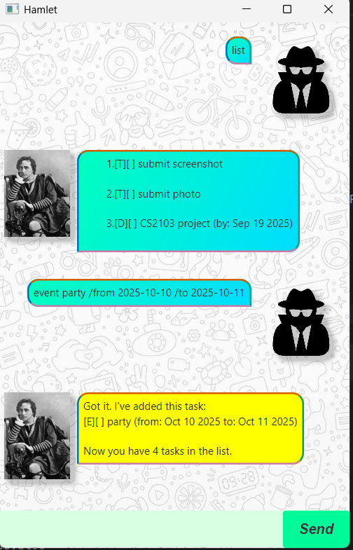

# Hamlet User Guide



Welcome to Hamlet, your personal desktop chatbot. I am here to help you manage your daily tasks, 
all while maintaining a dignified and contemplative demeanor. To begin, simply type your command below.

# Example usage

Example: `todo do homework`

Output

```
Got it. I've added this task:
[T][ ] do homework

Now you have 1 tasks in the list.
```

# Feature list

## Adding a New Task
### todo
Use this for a simple task with no deadline.

Usage:  `todo <description>`

Example: `todo read a book`

### deadline
Use this for a task that needs to be done by a specific date.

Usage: `deadline <description> /by <YYYY-MM-DD>`

Example: `deadline write essay /by 2025-09-30`

### event
Use this for an event that has a start and end date.

Usage: `event <description> /from <YYYY-MM-DD> /to <YYYY-MM-DD>`

Example: `event birthday party /from 2025-10-01 /to 2025-10-01`

## Managing Your Tasks
### list
To view all of your tasks in one place.

Usage: `list`

### mark
To mark a task as completed.

Usage: `mark <index>`

Example: `mark 2`

### unmark
To mark a completed task as not done.

Usage: `unmark <index>`

Example: `unmark 2`

### delete
To remove a task from the list.

Usage: `delete <index>`

Example: `delete 3`

## Finding and Sorting Tasks
### find
To find tasks containing a specific word.

Usage: `find <keyword>`

Example: `find report`

### sort
To sort your tasks by their date. Tasks with no date will be listed first.

Usage: `sort`

### sort done
To sort your tasks by their completion status, with uncompleted tasks listed before completed ones.

Usage: `sort done`

## General Commands
### what is your name
I shall respond with my name.

Usage: `what is your name`

### bye
To end our conversation.

Usage: `bye`